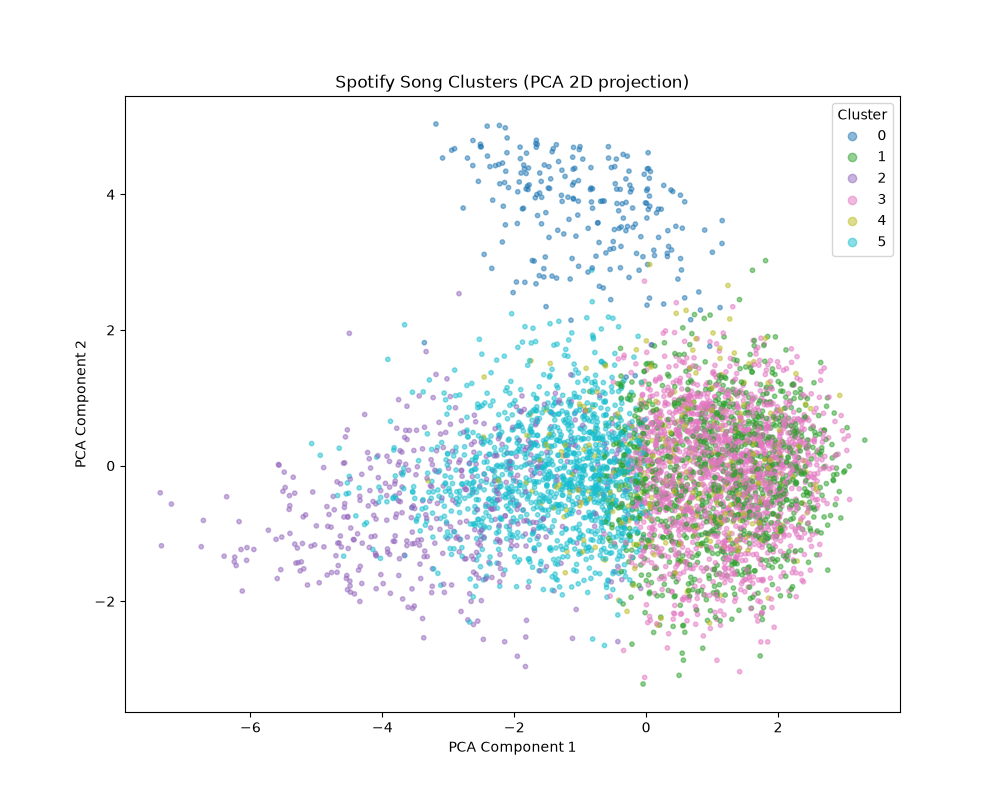

# Spotify Song Clustering & Segmentation

This project performs unsupervised machine learning (K-Means Clustering) on a large Spotify tracks dataset containing approximately **586,000 songs**. By analyzing audio features, it groups songs into distinct acoustic profiles.

---

## 📊 Methodology

### 1. Feature Selection
We analyze **12 key numeric audio features** that define a song's sonic profile:
* `danceability`, `energy`, `valence`, `acousticness`, `tempo`, `loudness`, `key`, `mode`, `speechiness`, `instrumentalness`, `liveness`, and `time_signature`.

### 2. Feature Scaling
Since audio features are measured on widely different scales (e.g., tempo ranges from 50 to 200+ BPM, while danceability ranges from 0 to 1), we scale all features using `StandardScaler` to have a mean of `0` and a standard deviation of `1`. This prevents higher-value features from dominating distance calculations.

### 3. Finding the Optimal K (Elbow Method)
We tested multiple values of $K$ (number of clusters) on a randomized subset of the dataset using the Elbow Method to find the optimal point of diminishing returns in inertia, selecting **$K = 6$** as the optimal number of clusters.

### 4. Dimensionality Reduction & Visualization
To visualize the high-dimensional clusters in a 2D space, we project the 12 features down to 2 principal components using **Principal Component Analysis (PCA)**. 

---

## 🎧 Cluster Interpretations

Based on the average feature profiles of each cluster, they can be described as follows:

*   **Cluster 0: Chill / Lounge Groove**
    *   *Characteristics:* High danceability, low-to-moderate energy, higher acousticness, lower tempo and volume. Perfect for relaxing, background vibes, or studying.
*   **Cluster 1: Energetic Pop**
    *   *Characteristics:* High danceability, high energy, high valence (happy/cheerful tone), low acousticness, and standard fast tempo. Upbeat commercial pop/dance hits.
*   **Cluster 2: Sad Acoustic Ballads**
    *   *Characteristics:* Very low energy, low danceability, very high acousticness, low tempo, quiet volume. Emotional, slow, acoustic/singer-songwriter tracks.
*   **Cluster 3: Upbeat Mainstream**
    *   *Characteristics:* High energy, high danceability, high valence, fast tempo, low acousticness. Energetic, mainstream tracks with slightly more commercial/modern attributes.
*   **Cluster 4: Live Recordings**
    *   *Characteristics:* High energy, moderate danceability, low acousticness, distinct live attributes. Typical of stadium concerts and live-session recordings.
*   **Cluster 5: Mellow / Moody**
    *   *Characteristics:* Moderate-to-low energy, moderate danceability, high acousticness, slow-to-mid tempo. Moody, atmospheric indie, or alternative R&B tracks.

---

## 📈 Visualizing the Clusters

Here is the 2D PCA projection of 5,000 sampled songs categorized into their respective clusters:



---

## 🚀 Running the Project

### Installation
Install the necessary python dependencies using pip:
```bash
pip install -r requirements.txt
```

### Run the Clusterer
Run the main script to fit the clustering model and predict a sample song:
```bash
python clusterer.py
```
